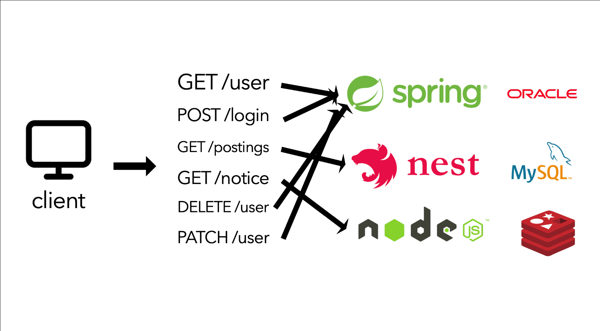

## MSA(MicroService Architecture)
MSA에 대한 정확한 정의는 없다. 하지만 MSA란 ```작고,
독립적으로 배포가 가능한 서비스로 구성된 프레임워크```라고 할 수 있다. 

MSA는 완전히 독립적으로
배포가 가능하고, 다른 기술 스택이 사용 가능한 단일 사업 영역에 초점을 두며,
독립된 서비스는 ```API```를 통해서만 상호작용한다.

## MSA가 각광받기 시작한 이유
기존의 시스템의 아키텍쳐는 대부분 ```모놀리식 아키텍쳐(Monolithic Architecture)``` 로
이루어져 있었다. 모놀리식 아키텍쳐란 정보 제공을 위한 화면부터 데이터베이스까지 하나의 흐름으로
묶여있는 아키텍쳐이다. 

이는 소프트웨어의 모든 구성 요소가 한 프로젝트에 통합되어 있는 형태로
웹 개발을 예로 들면 웹 프로그램을 개발하기 위해 모듈별로 개발을 하고, 개발이 완료된 웹
애플리케이션을 하나의 결과물로 패키징하여 배포되는 형태를 말한다.

하지만 수많은 모듈들이 하나로 묶여있는 만큼 단점 또한 확실한데, 
* **일부 모듈의 장애가 시스템 전체 장애로 확대될 수 있다.**
* **부분적으로 서비스를 변경하기 힘들며, 수정 시 장애의 영향을 파악하기 힘들다.**
* **배포하는데 시간이 매우 오래 걸리며, 특정 프레임워크와 언어에 종속될 수 밖에 없다.**

기존에 채택하던 모놀리식 아키텍쳐에 문제점들을 보완하기 위해 MSA가 등장하게 되었다.

***
## MSA의 특징
<p align="center">
    
</p>

위의 그림으로 대충 모놀리식과 마이크로서비스의 차이를 알 수 있을 것 같다.
모놀리식은 `````하나의 큰 구조 안에 모든 모듈을 다 집어 넣은````` 모습인 반면,
마이크로 서비스는 ```각각의 모듈이 구분```되어 있는 모습이다.

우리가 개인적으로 만들거나 규모가 작은 프로젝트에서는 MSA를 도입할 이유를 크게 못느낄 수
있지만, 카카오톡의 ```채팅```, ```기프티콘```, ```회원```, ```쇼핑``` 등등의 기능들이
한 백엔드 애플리케이션에 합쳐져 있다면 모듈이 구분되지 못하여 모듈간의 ```의존도```가 높아지며,
코드 양이 어마어마하게 많아져 ```유지보수```가 어려워질 것이다.

MSA의 가장 큰 측징은 독립된 모든 구성요소들이 ```API를 통해서 상호작용```하는 것인데,
서비스의 ```엔드 포인트(end-point)```를 API 형태로 외부에 노출하여 내부의 구현 로직,
아키텍쳐와 프로그래밍 언어, 데이터베이스와 같은 기술적인 부분들은 서비스 API에 의해
철저하게 보안된다.

또한 MSA는 SOA에서 사용되는 집중화된 관리 체계를 사용하지 않으며, ```REST``` 등 가벼운 통신
아키텍쳐, 또는 ```Kafka``` 등을 이용한 ```message stream```을 주로 사용한다.

제대로 설계된 MSA는 하나의 비즈니스 범위에 맞춰 만들어지므로 하나의 기능만 수행한다.
즉, 애플리케이션 출시처럼 하나의 목표를 향해 일하지만 ```자기가 개발하는 서비스만 책임진다.```

따라서 MSA와 같은 아키텍쳐를 채택한다면 아래와 같이 각각의 모듈들이 구분되어 자신이
담당하는 서비스만 책임질 수 있게 된다.



***

# 정리
***
## 모놀리식
### 모놀리식의 장점
1. ```소규모 프로젝트```에서는 ```합리적```이다.
2. 개발, 빌드, 배포, 테스트가 용이하다.


### 모놀리식의 단점
1. 어플리케이션 구동시간이 늘어나고 ```빌드```, ```배포``` 시간이 길어진다.
2. 조그마한 ```수정사항```이 있어도 전체를 다시 ```빌드```하고 ```배포```를 해야한다.
3. 많은 양의 코드가 몰려있어 ```유지보수```가 힘들다.
4. 일부분의 오류가 전체에 영향을 미친다.
5. 기능별로 알맞는 기술, 언어, 프레임워크를 선택하기가 까다롭다.
6. ```scale out```이 불가능 하다.

***

## MSA
### MSA의 장점
1. **개발이 빨라진다** - 각각의 서비스가 ```모듈화``` 되어있어 각 서비스 개발을 빠르게 할 수 있으며, ```유지보수```가 쉬워진다.
2. **팀 단위로 적절한 수준에서 기술 스택을 다르게 가져갈 수 있다** - 회사에서 백엔드가 ```spring``` 기반임에도 ```MSA```를 적용하면 ```Nest.js```를 사용할 수 있음
3. **서비스별로 ```독립적 배포```가 가능하다** - ```CD(지속적인 배포)```도 모놀리식에 비해서 가볍게할 수 있다.
4. **각각의 서비스마다 scale-out이 가능하다** - 각각의 서비스 부하에 따라 개별적 [scale-out](https://tecoble.techcourse.co.kr/post/2021-10-12-scale-up-scale-out/)이 가능하다 - 메모리, CPU적으로 상당부분 이득이 된다.

### MSA의 단점
1. **모놀리식에 비해 상대적으로 복잡하다** - 서비스가 모두 분산되어 있기 때문에 개발자는 내부 시스템의 통신을 어떻게 가져가야 할지 정해야한다.
2. **트랜잭션을 유지하기 어렵다** - 모놀리식에서는 단일 트랜잭션을 유지하면 됐지만 MSA에서는 비즈니스에 대한 DB를 가지고 있는 서비스도 각자 다르기에 서비스의 연결을 위해서는 통신이 포함되기 때문에 트랜잭션을 유지하기 어렵다.
3. **통합테스트가 어렵다** - 개발 환경과 실제 운영환경을 동일하게 가져가는 것이 쉽지 않다.
4. **실제 운영환경에 대해서 배포하는 것이 쉽지 않다** - 서비스 1개를 재배포하면 다른 서비스들과의 연계가 정상적으로 있는지 재확인 해야한다.

