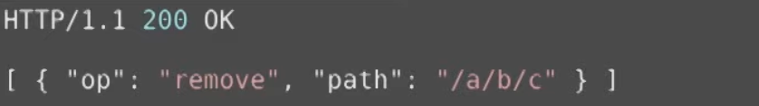
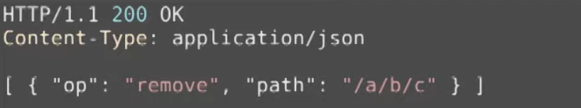
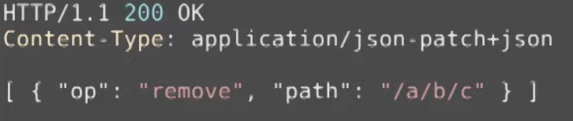
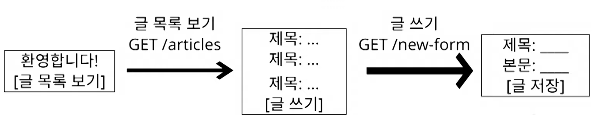
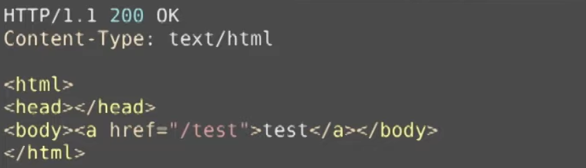
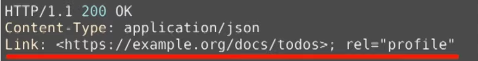
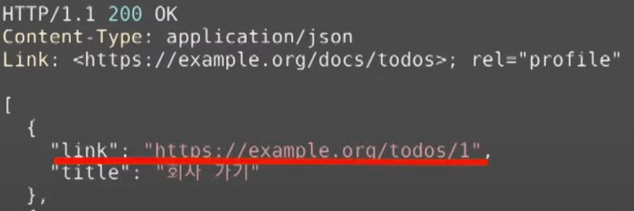
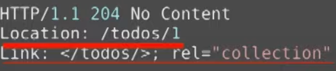

## 시작하기 전에
잘 알려져 있지만 뭔가 미묘하게 잘 모르는, 팀 프로젝트를 하는 상황이고 코드 리뷰 등을 할 때 누군가가
> "그 부분은 뭔가 REST스럽지 않은데요?"

라고 말한다면, 

> **"이런게 REST API 인데요?"** 
 
라고 반박은 해주고 싶은데 본인도 사실은 매일 REST 스타일로 개발하는 본인도 잘 모르는 경우가 많다.

## REST
**RE**presentational  
**S**tate 
**T**ransfer 

컴퓨터 시스템간의 상호 운영성을 제공하는 방법 중 하나이다.

### WEB(1991)
> "어떻게 인터넷에서 정보를 공유할 것인가?" (인터넷만 존재하는 시기)

가 기존 인터넷들의 문제점들 중 하나였다. 이에 대한 해답으로 **WEB**이 등장함 (월드 와이드 웹(WWW)이 [팀 버너스-리](https://ko.wikipedia.org/wiki/%ED%8C%80_%EB%B2%84%EB%84%88%EC%8A%A4%EB%A6%AC?tableofcontents=1)에 의해 탄생)
 
 

> "정보들을 하이퍼텍스트로 연결하자"
> * 표현 형식 : HTML
> * 식별자 : URI
> * 전송 방법 : HTTP

위의 명세를 바탕으로 HTTP/1.0(1994~1996) 프로토콜을 개발하게 됨(_기존에 사용하고 있던 HTTP에서 더욱 명세에 기능을 더하고 기존의 기능을 고친_)

#### Roy T. Fielding(1994~1996)
> "어떻게 하면 기존에 HTTP로 구축되어 있던 웹들과 호환성의 문제가 생기지 않게 개발할 수 있을까?"

### HTTP Object Model(1994)
Roy T. Fielding이 제기했던 문제점들을 해결할 수 있는 방안

## REST의 공식 발표(1998, 2000)
(1998) Roy T. Fielding이 Microsoft Research에서 HTTP Object Model을 **REST**이라는 이름으로 발표

(2000) 박사급 논문으로 발표

이 때 발표한 논문이 우리가 오늘날 알고 있는 [REST를 정의하는 논문](https://www.ics.uci.edu/~fielding/pubs/dissertation/top.htm)이다.

***

## API
인터넷상에 API라는 것이 만들어지기 시작함

1998년에 마이크로소프트가 **XML-RPC**라는 원격으로 다른 시스템의 메서드를 호출할 수 있는 프로토콜을 만듦 -> **SOAP**

### Salesforce API(2000) - **SOAP 형태** - 매우 복잡하고 어려움
 

### filckr(2004) - **SOAP 형태 && REST 형태** - SOAP보다 매우 쉽고 간결해짐
 

### 사용자들이 생각한 SOAP와 REST의 차이점

|SOAP|REST|
|------|---|
|복잡하고|단순하고|
|규칙많고|규칙적고|
|어려운|쉬운| 

### 결과

***

## 월드 와이드 웹(WWW)이 REST API로 정착하기 위해서

### CMIS 등장(2008)
* [CMS](https://ecommerce-platforms.com/ko/glossary/content-management-system-cms)를 위한 표준
* EMC, IBM, Microsoft 등이 함께 작업
* **REST 바인딩 지원**

> Roy T. Fielding : "CMIS에 **REST**는 존재하지 않는다."

### Microsoft REST API Guidelines(2016)
마이크로소프트가 REST API에 대한 구체적인 [가이드라인](https://github.com/Microsoft/api-guidelines/blob/master/Guidelines.md) 제시
* [URI는 https://{serviceRoot}/{collection}/{id} 형식이어야 한다.](https://github.com/Microsoft/api-guidelines/blob/master/Guidelines.md#92-serialization)
* [GET, PUT, DELETE, POST, HEAD, PATCH, OPTIONS를 지원해야 한다.](https://github.com/Microsoft/api-guidelines/blob/master/Guidelines.md#74-supported-methods)
* API [버저닝](https://wiserloner.tistory.com/466)은 [Major.minor로 하고 URI에 버전 정보를 포함시켜야 한다.](https://github.com/Microsoft/api-guidelines/blob/master/Guidelines.md#121-versioning-formats)
* [쉽게 이해할 수 있도록 일관성을 지켜야한다.](https://github.com/Microsoft/api-guidelines/blob/master/Guidelines.md#7-consistency-fundamentals)
* [기본 유형에 대한 JSON 형식의 기본 값은 RFC4627 규칙에 따라 JSON으로 직렬화되어야 한다.](https://github.com/Microsoft/api-guidelines/blob/master/Guidelines.md#11-json-standardizations)
* ....

> Roy T. fielding : "이것은 **REST API**가 아니라, **HTTP API**라고 해야한다."

***

> Roy T. fielding : "이런것들(CMIS, Microsoft REST API Guidelines)을 REST라고 부르려면 [**"hypertext-driven"**](https://roy.gbiv.com/untangled/2008/rest-apis-must-be-hypertext-driven) 이어야 하며, REST API를 위한 최고의 버저닝 전략은 버저닝을 안 하는 것이다."
> * hypertext : 컴퓨터나 다른 전자기기로 한 문서를 읽다가 다른 문서로 순식간에 이동해 읽을 수 있는 비선형적 구조 || 다른 문서와 쉽게 연결이 되도록 한 '링크'의 모음으로 구성된 문서

***
## Roy T. fielding이 정의하는 REST API

### REST 아키텍쳐 스타일을 따르는 API

> REST : 분산 하이퍼미디어 시스템(ex: web)을 위한 아키텍쳐 스타일  
> 아키텍쳐 스타일 : **제약 조건의 집합**

아키텍쳐 스타일에 제시된 제약 조건들을 모두 따라야 REST API라고 부를 수 있음.

### REST 아키텍쳐 스타일
* client-server
* stateless
* cache
* **uniform interface**
* layered system
* code-on-demand(optional)

## Uniform Interface의 제약 조건
* identification of resources - 리소스가 uri로 식별되야 함
* manipulation of resources through representations - representations을 통해서 자원을 조작해야 한다.
* **self-descriptive messages** - 스스로 설명하는 메시지가 되어야 한다.
* **hypermedia as the engin of application state (HATEOAS)** - 애플리케이션의 상태가 Hyperlink를 통해서 전이되어야 한다.

***

### Self-descriptive messages

### Self-descriptive 하지 못하는 경우 - 1
API의 목적지가 어디인지 알 수 없음 

### Self-descriptive 하는 경우 - 1

***
### Self-descriptive 하지 못하는 경우 - 2
어떠한 문법으로 작성된 API 인지 알 수 없음

Content-Type Header를 추가해서 작성한 문법을 알 수 있지만, "op"가 무엇이고, "path"가 무엇을 의미하는지 알 수 없다.

### Self-descriptive 하는 경우 - 2
Media-Type(json-patch+json)을 추가해 줌으로써 이 Media-Type의 명세를 찾아서 "op", "path"가 의미하는 것을 알 수 있다.

***

### HATEOAS
애플리케이션의 상태가 Hyperlink를 통해서 전이되어야 한다.
### HATEOAS - 애플리케이션(게시판)

#### HTML을 통한 HATEOAS

## 왜 이걸 Uniform Interface ?

**REST를 만들게 된 계기** : 어떻게 하면 기존에 HTTP로 구축되어 있던 웹들과 호환성의 문제가 생기지 않게 개발할 수 있을까?

* 서버와 클라이언트가 각각 **독립적으로 진화**
* 서버의 기능이 변경되어도 클라이언트를 업데이트할 필요가 없음

> **참고** : 클라이언트와 서버가
> 상호간 데이터를 주고 받는 형태의 아키텍쳐(REST)를 가지고 있기 때문에 서버와 클라이언트가
> 독립적으로 진화할 수 있다.

따라서 Uniform Interface가 반드시 만족되어야 REST API라고 부를 수 있음

## REST가 잘 지켜지고 있는 예

    

* 웹 페이지를 변경했다고 해서 웹 브라우저를 업데이트할 필요는 없다.
* 웹 브라우저를 업데이트했다고 웹 페이지를 변경할 필요가 없다.
* HTTP 명세가 변경되어도 웹은 잘 동작한다.
* HTML 명세가 변경되어도 웹은 잘 동작한다.

***

## 따라서
|SOAP| REST            |
|------|-----------------|
|복잡하고| 단순하고            | 
|규칙많고| 규칙적고            |
|어려운| ~~_쉬운_~~ -> 어려운 | 

### 그럼 API는 꼭 REST API를 사용해야 하는가?
> Roy T. Fielding : 시스템 전체를 통제할 수 있거나, 
> 진화에 관심이 없다면 REST에 대해 따지느라 시간을 낭비하지 마라

### 시스템 전체를 통제하는 경우
* 서버 개발자가 클라이언트 개발자를 마음대로 통제할 수 있는 경우
* 혼자 서버와 클라이언트를 다 만드는 경우

### 진화에 관심이 없는 경우
* 본인이 만든 서비스에 대한 평가를 잘 받아들이지 않는 경우(본인 판단)

### 우리가 만든 API는 이제 어떻게 불러야 할까?
1. REST API를 구현하고 REST API라고 부른다. - 제일 좋음
2. HTTP API라고 부른다.
3. **REST API가 아니지만 REST API라고 부른다.** - 현재 우리들의 상황

***

## HTML과 JSON의 Self-descriptive와 HATEOAS
| 구분                   | HTML | JSON |
|----------------------|---|---|
| **Self-descriptive** | O | O | 
| **HATEOAS**| X | X |

## Self-descriptive와 HATEOAS가 독립적 진화에 어떻게 도움이 될까 ?

### Self-descriptive - 확장 가능한 커뮤니케이션
> 서버나 클라이언트가 변경되더라도 오고가는 메시지는 언제나 self-descriptive 하므로 언제나 해석이 가능하다.

### HATEOAS - 애플리케이션 상태 전이의 late binding
> 어디서 어디로 전이가 가능한지 미리 결정되지 않는다. 어떤 상태로 전이가 완료되고 나서야
> 그 다음 전이가 일어날 수 있는 상태가 된다. -> 링크는 동적으로 변경될 수 있다.

***

## JSON이 Self-descriptive를 만족시키는 방법
### 방법 1 : Media-type 등록
1. 미디어 타입 정의 : 
2. 미디어 타입 문서 작성 : "op"는 뭐고, "path"는 뭐다
3. IANA에 미디어 타입을 등록한다. - 이 때 만든 문서가 미디어 타입의 명세가 됨
4. 이제 application/json-patch+json 이라는 media-type을 보는 사람은 IANA에서 명세를 보고 해석할 수 있음

단점 : 매번 Media-Type을 IANA에 올려야 하기 때문에 매우 귀찮다.

### 방법 2 : Profile
1. "id"가 뭐고, "title"이 뭔지 의미를 정의한 명세를 작성한다.
2. Link 헤더에 profile relation으로 해당 명세를 링크한다.

단점 : 클라이언트가 Link 헤더와 profile을 이해해야하고, Content negotiation을 할 수 없다.

***

## JSONdl HATEOS를 만족시키는 방법
### 방법 1 : data
data에 다양한 방법으로 하이퍼링크를 표현한다.

단점 : 링크를 표현하는 방법을 직접 정의해야한다.

### 방법 2 : HTTP 헤더 사용하기
Location 또는 Link를 사용하여 헤더로 링크를 표현한다.

***

## 정리
* 우리가 부르는 대부분의 "REST API"는 REST를 따르지 않고 있다.
* 특히 REST의 제약조건인 **Self-descriptive**와 **HATEOAS**를 잘 만족시키지 못한다.
* REST를 따르겠다면, **Self-descriptivedhk**와 **HATEOAS**를 만족시켜야 한다.
    * Self-descriptive : **custom meadia-type**이나 **profile link relation** 등으로 만족시킬 수 있다.
    * HATEOAS : HTTP 헤더나 본문에 **Link**를 담아 만족시킬 수 있다.
* REST API를 따르지 않겠다면, 뭐라고 부를지 결정해야 한다.